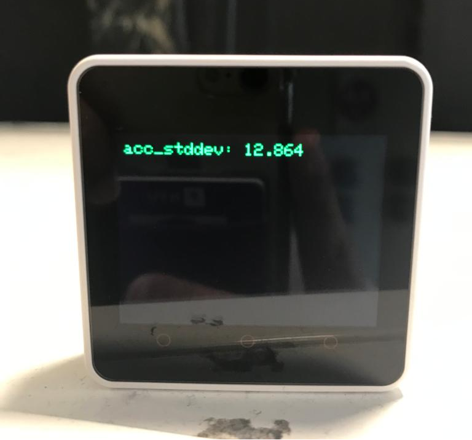

# NYUAD Laundry Monitoring System    

### Background

Laundry facilities in college and university housing are a crucial component of campus life. Yet it has been found that it can be a source of frustration for students, with overcrowded laundry rooms and the risk of lost or stolen clothing. Students new to doing their laundry may make common mistakes that result in damaged clothing and prevent others from finishing their laundry in time. According to reports from students at New York University Abu Dhabi (NYUAD), there have been concerns and frustrations surrounding the campus laundry facilities, in fact in a poll conducted on the class of 2026, 27 out of 164 students reported stolen/lost clothes. This highlights the importance of improving laundry facilities and addressing students' concerns to enhance the overall campus living experience. Laundry is an essential need, and the efficiency of washing facilities can impact students' daily routines and well-being.

### Problem Definition

At New York University Abu Dhabi (NYUAD), the laundry facilities have been a source of
frustration for students due to overcrowding and the potential for lost or stolen clothing.
Furthermore, students new to doing their laundry may make common mistakes that result in
damaged clothing and delays for others.

To address these concerns, this project aims to create a system that will enhance the laundry
experience for students at NYUAD by achieving the following objectives:

- [x] Reduce overcrowding in laundry rooms by providing real-time monitoring of washing
machines and dryers availability.
- [x] Allow for online booking of washing machines and dryers using a queue data structure,
and notify users (via email) when their turn for an empty washing machine/dryer came.
- [x] Decrease the risk of lost or stolen clothing by notifying students when their laundry is
done (via email) to come pick it up.
- [x] Assist newcomers with proper usage of the machines through the webpage to improve their
laundry experience.

### Project Components

This project consists of three main components that function together to make our laundry monitoring system work.

1. M5Stack Monitors
2. Server
3. Front-end Interface (Website)

The idea is that we should have an M5Stack placed on every washing machine and every dryer to monitor if it is working or not by means of detecting vibrations. The M5Stack will then communicate with the server which acts like the brain and the master of our entire laundry monitoring system. It’ll store the state of all machines, the number of available machines of each type in every building and the queues on both types of machines in every building. The server will also serve users a website which is a platform through which users can get data on the number of available machines, can sign up for queues and can monitor their own currently working laundry.

The method by which an M5Stack detects whether the machine it is on attached to is already in a cycle or not is by calculating the standard deviation of the accelerometer data magnitude in order to detect vibrations. Below are photos for the accelerometric standard deviation for an M5Stack on a free and a busy machine respectively. A big clear difference is observed and therefore a cutoff is chosen in between to differentiate between working and free machines.

  
   

### UI

##### M5 Stack

When the M5Stack is turned on, a setup process is done to initialise the basic information about the machine this M5Stack will be monitoring, namely

1. The building
2. The machine type and number (machine id)

A menu that looks exactly like the image shown below will show up once the device is turned on, the user can switch through the menu by clicking on the arrows to the left and right and different buildings will show up. When the user wants to select the building this M5Stack machine is in they can just click on the name of the building (the center of the screen). A similar menu will be shown for the machine id (type of machine and machine number).

And the following screens are presented when the machine is free, used or reserved by a person (se2422 in this case) respectively.

  
   
  

##### Webpage

The interface follows the usual NYU purple theme, that makes it feel familiar and welcoming to NYUAD students. The user is first prompted to choose their building which they can do by clicking on the menus and choosing their building and sub-building from the options that drop down as shown in the picture below.

